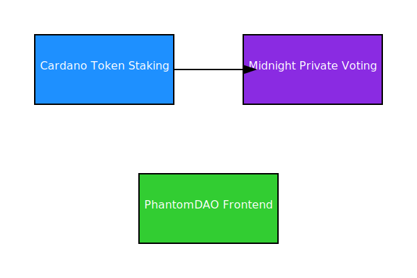

# PhantomDAO Architecture

This diagram illustrates the high-level architecture of PhantomDAO:

- Cardano: Governance token staking and verifiable balances
- Midnight: Private vote execution, tally, and quorum verification
- Cross-Chain Bridge: Links Cardano staking to Midnight voting rights
- Frontend DApp: Interface for users to submit votes and view proposals

